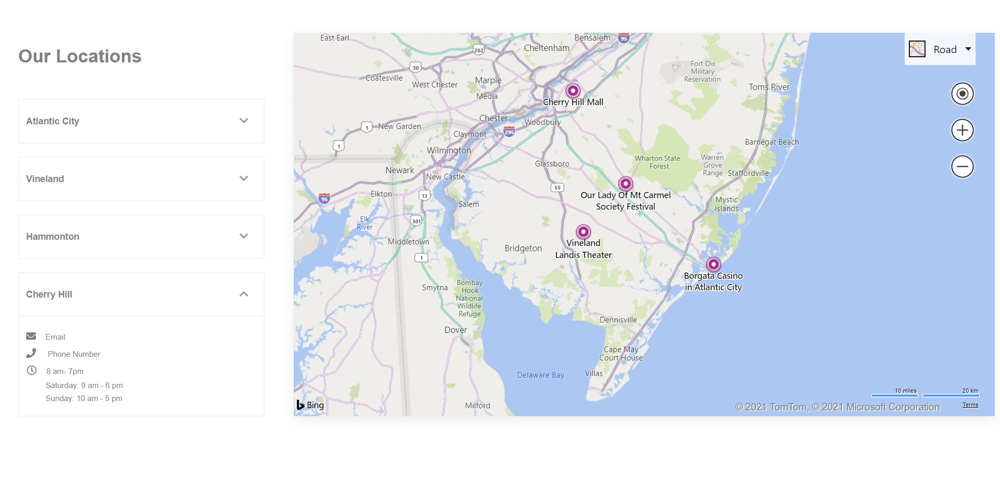
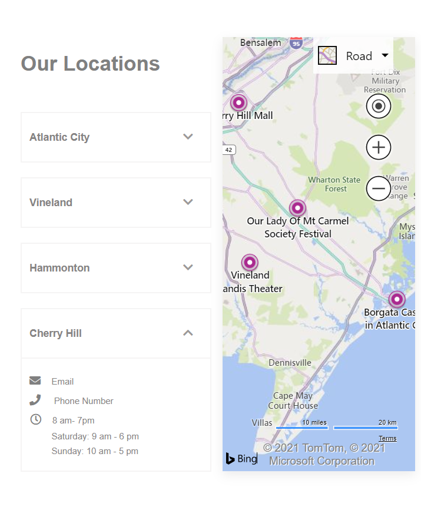

## Table of contents

- [Overview](#overview)
  - [Screenshot](#screenshot)
  - [Links](#links)
- [My process](#my-process)
  - [Built with](#built-with)
  - [What I learned](#what-i-learned)
- [Author](#author)

## Overview

### Screenshot

[Live Site URL](https://sonndy.github.io/Contacts-Locations/)

## My process

### Built with

- Semantic HTML5 markup
- CSS Grid
- Mobile-first workflow
- Font awesome
- Bing API
- Map pushpin

### What I learned
I learned the importance of reading the documentation before using an API (Application Programming Interface), not only does it help the users understand what they are implementing but it also makes it easier and less stressful to use the API. By reading the documentation it was super easy for me to implement the Bing API in my project and understand in depth what was available in the API.

## Author

- Website - [Sonndy Exantus](https://sonndy.com/)
